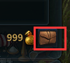

#   游戏交易
**线下交易有风险，官方不支持线下交易！**

**线下交易有风险，官方不支持线下交易！**

**线下交易有风险，官方不支持线下交易！**

诚信和道德只能防君子，不能防小人

## 金币包
-   “金币包”是提供存取账号金币、上架高价值道具的功能

    

    -   105级开启“金币包”功能，暂时支持取出金币、使用“收集箱”功能
    -   110级“金币包”开放所有功能，交易所上架的道具售价最高为40亿金币，账号共享金币最多600亿金币
    -   **使用“金币包”上架道具，将不可使用“高级登记”**

##  高级登记
-   使用“高级登记”上架道具：
    -   道具售价最高为10亿金币
    -   道具会在同类商品中置顶，提高曝光率
    -   交易成功后，不会扣除交易手续费
    -   7天后若交易不成功， [高级交易所使用券]不会返还

-   [高级交易所使用券]是在上架道具时选择“高级登记” 所需消耗的道具

    

    -   商城出售。6.9元/个，49.9元/10个

> [!tip|label:提示]>  当R/20＞5时，使用[高级交易所使用券]更划算，R=等值于10亿金币的红票子
        

##  金币交易
-   邮箱交易金币
    -   索要金币：
        -   输入索要的金币数量——点击“发送”——对方收到索要邮件后，支付金币，含有金币的邮件将会返回
        -   **“索要金币”会从索要的金币中扣除5%金币数量，你最终会获得索要金币的95%的金币数量**

    
    -   寄送金币：
        -   输入寄送的金币数量——点击“发送”
        -   **“寄送金币”会根据你邮寄的金币数量和发送邮件的方式，向你收取手续费**
            -   特快邮件：5%
            -   普通邮件：2%

    

-   交易所交易金币
    -   购买金币：
        -   上架低价值的道具——选择“金币”，输入购买的金币数量——“手续费”选择“高级登记”——点击“登记”

        -   告知卖家出售的道具名称，等待卖家购买即可

        

> [!Attention|label:注意]>  尽量通过支付宝进行交易。

##  时装交易
-   邮箱交易时装
    -   金币交易：通过索要功能即可，**注意索要的金币数量！**
    -   现金交易：通过邮寄功能即可

-   交易所交易
    -   金币交易：跟买家/卖家沟通即可

> [!Attention|label:注意]> 时装无法整套邮寄，必须拆开邮寄。部分时装存在两种样式可供选择，选择时请跟买家/卖家沟通好样式

##  以物易物
-   [解除绑定药水]换[高级强化药水]/[扎尔丁钢铁]
    -   将道具邮寄给对方，对方收到后将1组（50个）[解除绑定药水]通过商城赠送给你
    -   [解除绑定药水]存放在背包——商城——临时储存箱

> [!Attention|label:注意]>  请务必确认你收到道具后，再赠送[解除绑定药水]

##  防骗提示
-   优先使用支付宝交易，支付宝账号最好是手机号，其次为QQ邮箱

    -   若转账账号为手机号，且支付宝提示该手机号支付宝长期未使用时，请中断交易跑路概率较高
    -   若转账账号为QQ邮箱，请搜索该QQ号，若QQ号等级少于3个太阳时，请中断交易大概率是小号

-   

