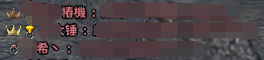

# 游戏常用语<!-- {docsify-ignore-all} -->
**游戏中常用的一些表述**

## 红名
指名称颜色为红色的玩家

## 板子进
按G键进入战役

## 打圈
通过[巡游出征战役](cruise/)功能进入队伍，连续完成多个战役

## 110两圈
通过“巡游出征战役”功能，完成110级战役，每个战役完成2次

> [!tip|label:提示]>衍生还有“105两圈”、“115一圈”等等

## 特殊
[特殊副本](#/equipment/?id=shouzhuo ':ignore')

> [!tip|label:提示]>“蓝皮”、“蓝精灵”指[失败和代价]战役;“澡娜”指[迷失的精灵]战役

## 求猫
请求对其使用[公会高级羽毛]或[公会天使羽毛]。“来个大猫”指请求对其使用[公会天使羽毛]

##  金牌
[艾因拉赫](goldmedal/)系列战役

## GSD
[敢死队战役](8dungeon/)的简称

> [!tip|label:提示]>G1指[邪念之海];G2指[屠戮之月]; G3指[砧上之剑];G4指[生命之树]

## 随缘
常见于敢死队战役队伍名，要求队员尽力即可，有战役失败的可能

> [!Attention|label:注意]> 随缘≠一定通关

## yx
[英雄模式](#/cruise/?id=hero ':ignore')的简称

## 首解
首次解除绑定

